+++
date = '2017-03-29T11:44:00'
draft = false
title = '3D Printed Engagement Ring'
+++

This is reproduced from a Imgur post that was automatically deleted once it was ~8 years old. Comments are 1:1 with image titles from the original post.

---

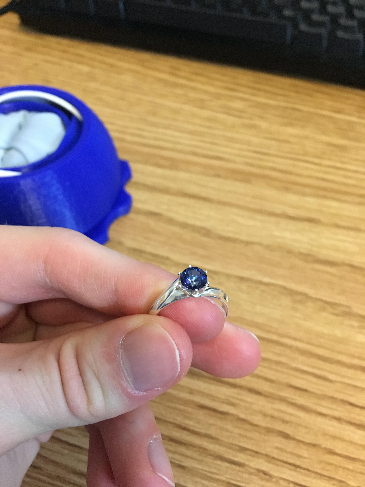

The final product, in pure silver with a blue passion topaz as the gem. I wanted to opt for the fancier, more proper sapphire, but my fiancée didn't like the cost behind it. I'm told that we can always upgrade, seeing as we can easily make a new ring.

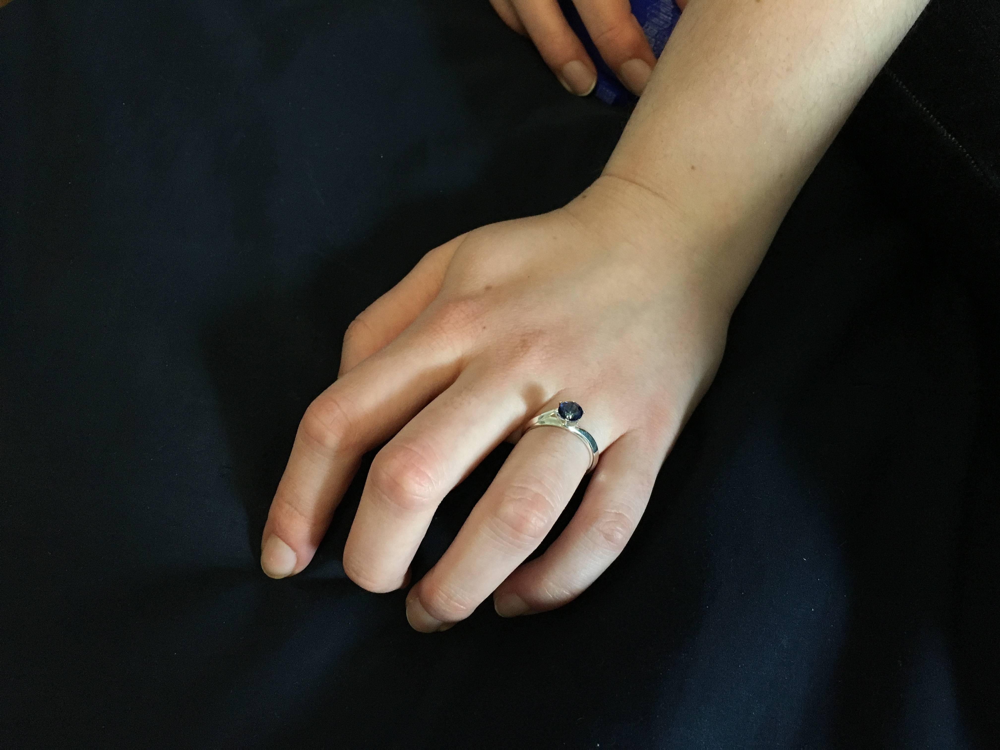

The ring on her finger. The gem looks a bit off in this picture as it hadn't yet been properly set. It fits perfectly, thanks to the prototyping abilities of my 3D printer.

This is how the ring started out, as a bunch of dimensions. Interestingly enough, the final dimensions ended up fairly close to what I wrote down here, at the beginning of the process. You can tell I am in no way an artist.

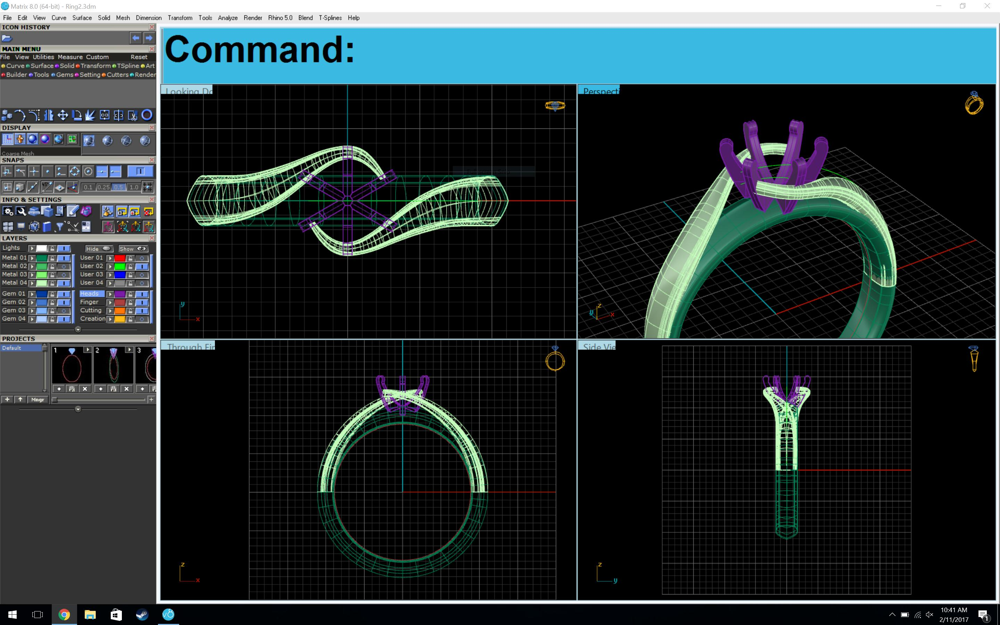

The ring itself was designed in a program called Matrix 8, a jewelry plugin for Rhino 3D. This program is several thousand dollars, so I used the copy of a friend. Matrix, while rather annoying at times (the blue bar at the top titled "Command" continued to grow larger until it filled my screen, multiple times), turned out to be a really powerful tool, and made it much easier for me to make my ideas into an actual model.

I am a software engineer, and although I have a working knowledge of CAD programs, I have no idea how to make organic shapes such as this ring. With Matrix, however, I could easily create the size of ring I wanted (literally just asking for a "Ring rail" of US size 6.5), set profiles at different points on the circle, and extrude along that curve, smoothly filling the area between the profiles. For the twist up to the setting, I was able to use 3D projections to match up two 2D lines (one for the x and one for the z-axes), then extrude between four curves (following more profiles). This process still took many, many hours, but I'm sure it was significantly easier than other methods.

If you are interested in doing something similar, I would highly recommend this video tutorial. The tutorial made this process bearable. https://www.youtube.com/watch?v=uICyWn5-zqc

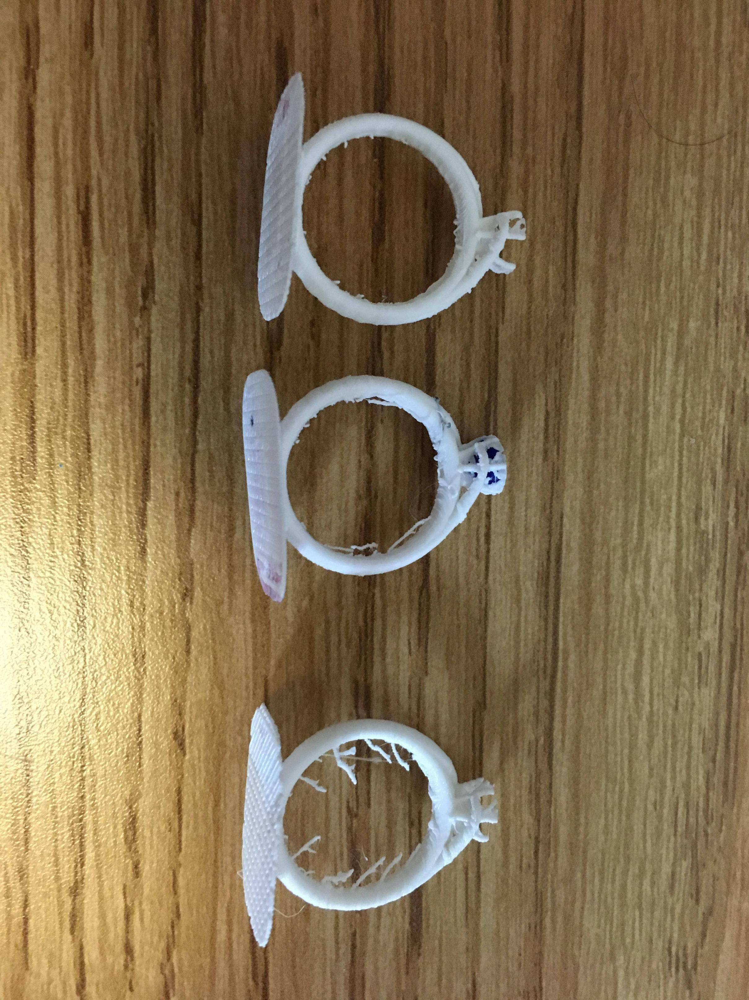

With a working 3D model of the ring, I could finally start to prototype the physical object. I own two 3D printers (which weren't working particularly well at the time), which allowed me to directly see the effect of the changes I made to the model. I quickly found out that I was placing the twirl near the setting too high up, and promptly lowered it for a more flowing design.

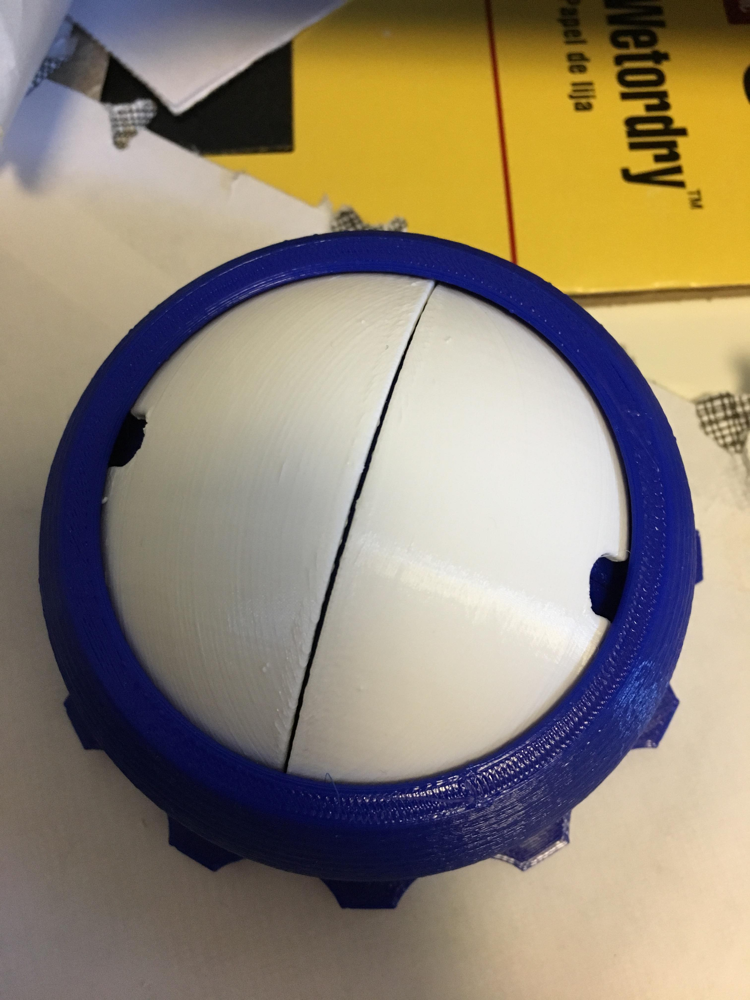

Simultaneously with the ring design, I began brainstorming what to do for a ring box. I stumbled upon this Venus Box (http://www.thingiverse.com/thing:1559232) on Thingiverse, which seemed rather perfect. Unfortunately, as I said previously, my 3D printers were not performing very well, so the entire box has a rough texture due to Z wobble. In spite of that, I think the box was more than adequate.

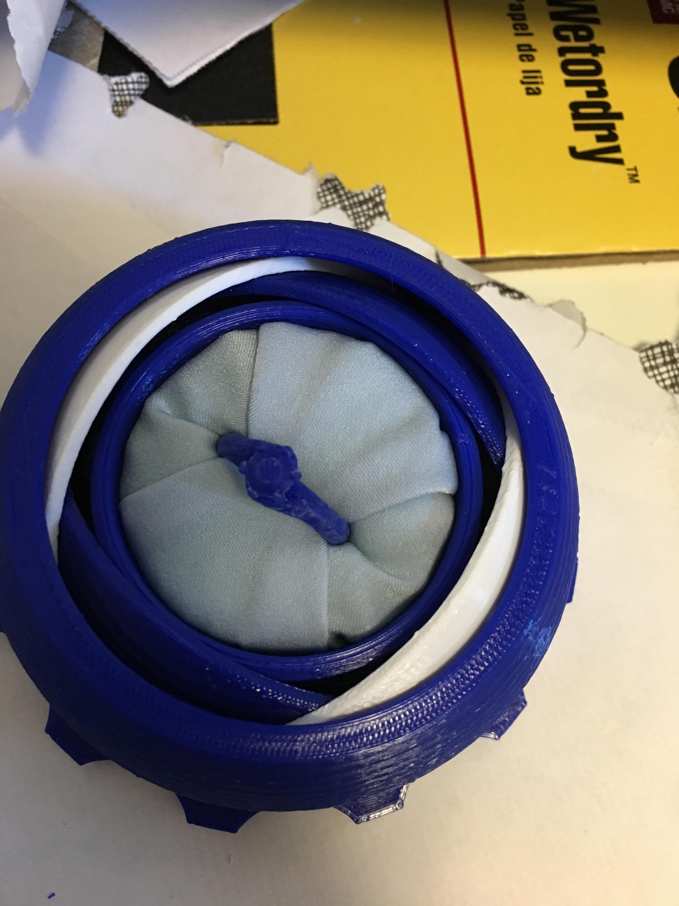

I wish I had more pictures to show, as the interior of the box was a huge pain to get right. After spending many hours brainstorming with /u/orikebise on Reddit, we finally decided on using high-density foam, with a slit cut in it, covered by fabric. The process of folding the fabric to not look like a mess or certain body parts took us (well, mainly /u/orikebise) many hours, but in the end I was very happy with the results. The ring shown here is yet another test print for sizing purposes.

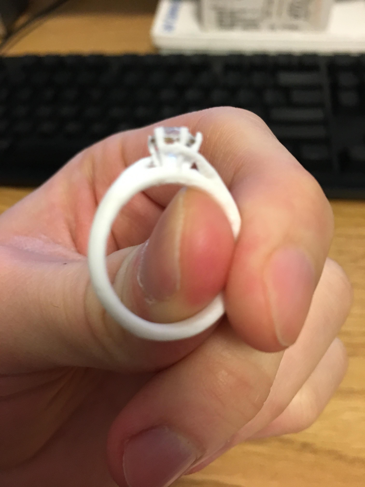

This blurry picture is the plastic ring I ended up proposing with. I ended up switching the plastic diamond with a plastic sapphire, as the colors seemed to complement each other better. After a good bit of sanding, the ring was smooth, presentable, and ready to go.

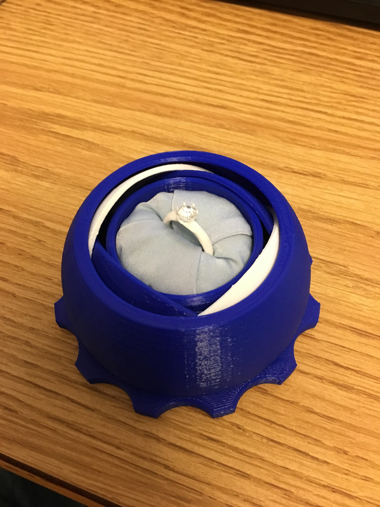

I decided to propose with the plastic ring to ensure the final product was nearly perfect. The sooner I showed her the ring and its design, the sooner I could get her feedback and make any necessary changes (such as size, design tweaks, etc). As it turned out, we didn't change anything about the design, but we did need to make the ring smaller (the finger measurements she gave me were much too small). After that, it was off to Shapeways to have the ring printed.

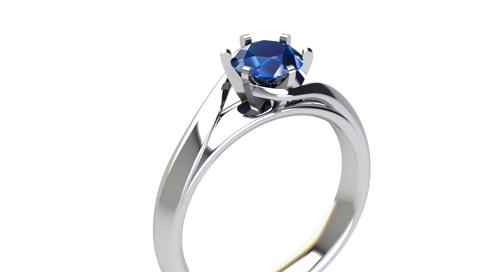

While waiting for the ring to be manufactured, I had Matrix render a few different shots with the ring with different gemstones to help us decide what gem to get. We very quickly settled on a sapphire, though we discovered that the ring also looked very good in rose gold.

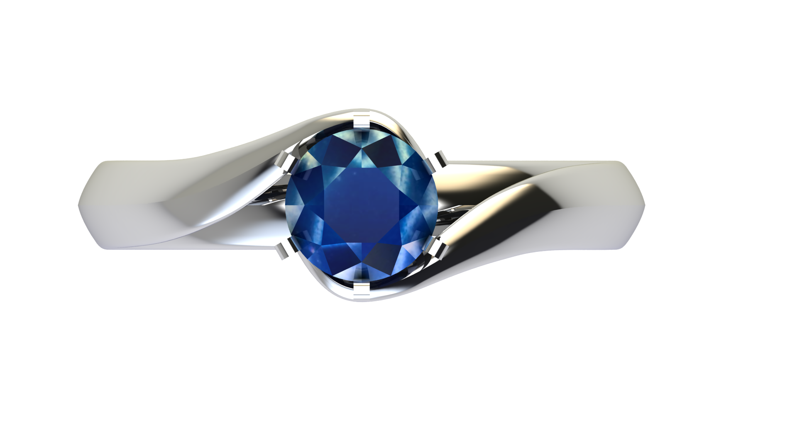

The blue from the sapphire seems to complement the silver color very well, in a way that isn't present with a diamond. I was happy she didn't want a diamond anyway, as I have always found diamonds to be very overused and not particularly interesting.

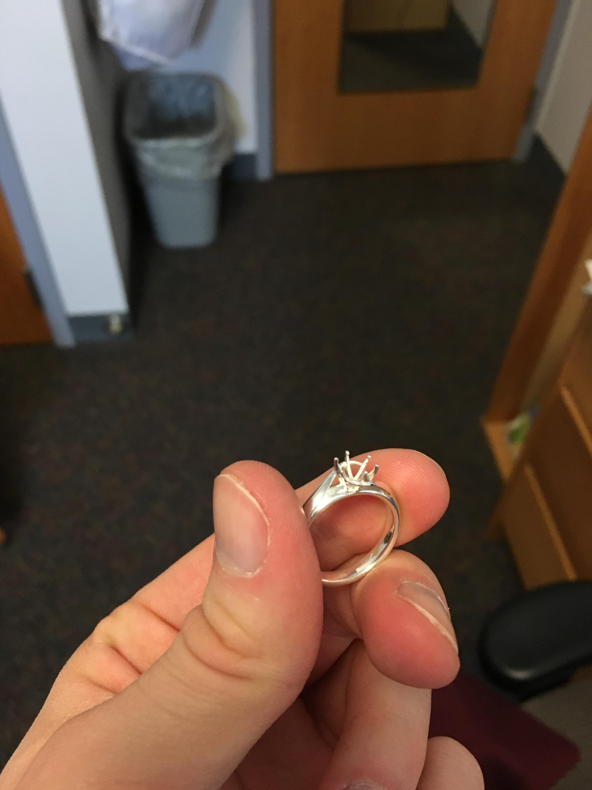

Around 10 days later, the ring was finally finished and in my hands. I was slightly disappointed in how it looked, but that may have simply been due to the lack of a gem. Once the ring arrived, my fiancée and I decided to try out blue passion topaz, partially because it was so cheap (two 1ct stones for $15 shipped) and partially because it appeared to have a very nice color. Again, she didn't like the (admittedly high) price of sapphires, so we've settled for a cheap alternative for the time being.

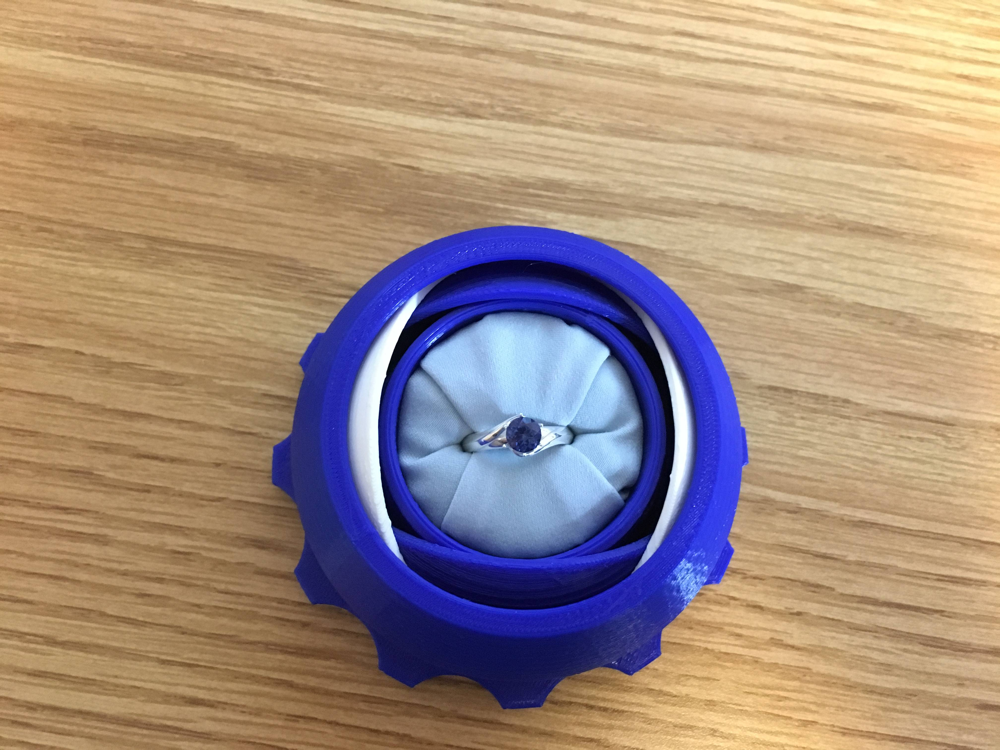

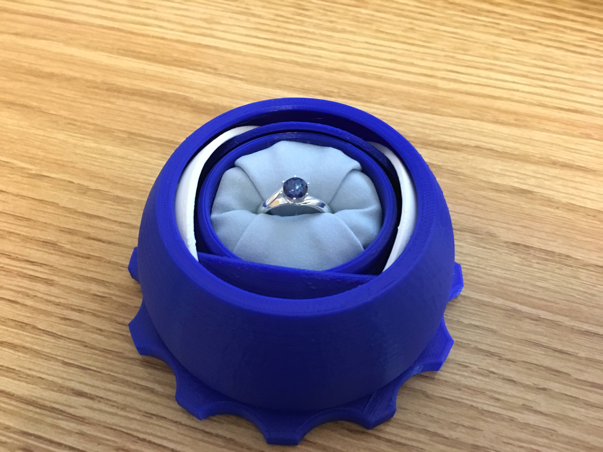

The final ring in its box. I think it turned out quite well, and of course my fiancée is happy with it. I really enjoyed this process and would encourage others to try it. It certainly beats buying an overpriced, mass produced ring.

The final ring
