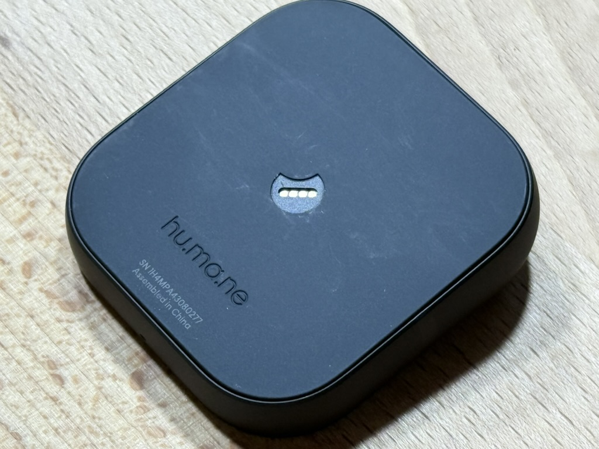

+++
date = '2025-10-04T20:27:09-07:00'
draft = false
title = 'Hacking the Humane Ai Pin'
+++

[Skip to the technical stuff](#first-access)

## Shutdown announcement

On February 18, 2025, Humane announced it would be shutting down all services for the always online Humane Ai Pin in ten days, [following a sale to HP](https://web.archive.org/web/20250219012718/https://humane.com/media/humane-hp). I had been vaguely aware of the Ai Pin, definitely more so than the average tech person, as I have a close friend who was one of the earliest adopters and eventually joined the Humane team to actively work on the device, but I ultimately knew little about them. I did know that they were small, had good industrial design, and had a cool laser. I also have drempt of a personal, local always listening device since I was a young teenager. I was a little more confident in my ability to help shape a niche device's ecosystem after my experiences driving the Analogue Pocket's growth, so I decided to go looking for disgruntled users looking to sell their devices.


I relatively quickly was able to secure two Pins, three boosters, and a charging "egg" from Reddit for a total of $300 (a price that I originally thought might be too much, though I would later see them selling for $300-500 each). One of my Pins was supposed to be locked (no code from a previous owner), so possibly unusable, but that was OK, as we were here to learn and break things. I paid for expedited shipping so I could get the devices before the shutdown. Unfortunately for me, my two Pins arrived on the fated shutdown day February 28th... ...about 2 hours _after_ the servers were shut off. There was a big community call on the Humane community Discord server (they called themselves reHumane) as the servers were turned off where some big fans and current/previous Humane employees talked about their experiences. I found it to be a weird experience overall, but it was interesting to see how passionate people were about these devices. Unfortunately with the devices I had purchased, the "working" device had been factory reset. Turns out that without Humane's servers to talk to, you can never activate the device, so I was stuck in the onboarding screens. I would later acquire another Pin (a still sealed one) bringing the total to three, but I never got to experience what a working Ai Pin was like.

At least I now had hardware. Now I needed a mechanism to connect the Pin to a computer. The Pin has four pads hidden behind a moon sticker at the bottom of the device; these pads are just raw USB 2.0. The only problem with connecting to them is they are 1.0mm pitch, which is quite small. To connect to test pads like this you use a dock called an interposer, often using pressure sensitive probes to contact the pads. There were some existing connector components that would maybe work, but they weren't 1.0mm pitch. I ended up buying 0.68mm diameter, 16.55mm fully extended spring probes from Amazon, and spent entirely way too long designing and iterating on a mechanism to allow a human to place these pins 1.0mm apart while still being able to solder wires to them. A mechanical engineer friend pointed out how stupid I was for not fanning them out, which proved to be the best strategy by far. [You can see my poor designs here](https://github.com/agg23/ai-pin-interposer). Eventually community members [GoinGhost](https://www.etsy.com/listing/1904242117/ai-pin-usb-dock-slim-final-ver-woptions) and [@MaxMaeder](https://openpin.org/about/interposers) produced more robust designs with proper PCBs and components, and I used those from then on. [I later produced revised 3D models](https://github.com/PenumbraOS/3dprints) for a better fit for Max's interposer.



## Examining leaked APKs

My Pins were both factory reset, and with Humane's servers down, I couldn't activate them, so there wasn't much to play with. However, on the day of the Humane shutdown, there was some other excitement. Someone posted an Archive.org link to a number of leaked APKs ripped from a device. It's important to note that no one from my side of the story ever had anything to do with any distribution. No sharing, no using decompiled code, nothing. Given the leaks, with no working Pins and the lack of an interposer design, there wasn't much left for me to do besides scour through those leaked files. Since Android is primarily JVM bytecode based, it is trivial to decompile most applications into something rather resembling the original source code. Humane didn't obfuscate their binaries, so all of the original names (variables, classes, enums) were present, making the code reasonably easy to read. At this point we had a number of people actively researching.

I was focused on getting past onboarding, since that's where my Pins were stuck. The main things I expected to look for were logic errors where a stray argument could cause a different code path, test code still around (like Android intents that could be launched with an ADB command), global settings, and if all else fails, a way to bypass cert pinning, if that was enabled on the authentication server connection (it was). Ultimately I decided that if there was a way to bypass it, I would not be capable of it without some notable vulnerability to inject code or provide priviledge escalation.

## Magical ADB cert

Suddenly one day about a week in I got a random anonymous message on Signal containing a single file of 1,704 bytes. I cautiously examine this rogue file in a hex editor and find that it looks like a real private key. I move it to `.android/adbkey`, run `adb kill-server`, then `adb shell` and suddenly I have an ADB connect prompt appearing on the laser display on the Pin. I was in. The private key appears to have been posted on the internet at about the same time and the rest of my development group quickly gained access as well.

## First access

As soon as I gained ADB access to the Pin I tried running a demo app, and a few minutes later I had it projecting my cat profile picture and displaying a live video feed from the camera. That's really good! Maybe we have full access to all of the hardware, and we're basically free to modify the device at will. I dumped as much of the filesystem as possible (which is necessarily incomplete due to the limited access due to non-root user) and figured how to disable the onboarding experience, dropping me into the (very non-functional) base `SystemNavigation` UI. However, attempting to connect to a remote HTTP server resulted in an exception and `avc` errors logged to the console.

[TODO] Where to put this?

I am rather unfamiliar with Android, having last developed on it approximately 15 years ago (and only barely then). Gaining access to the Pin was a whole new set of things to learn. I am very skeptical about the future of generative AI as it is, its concerns for the future of humanity, copyright, and more, but I used this project as my first entry in trying to familiarize myself with appling LLMs for technical work. I can very confidently say that I could not have figured out what I did about Android without the help of LLMs. The codegen was of questionable worth, but the research was invaluable, even though there were several instances directed by LLM that wasted a double digit number of hours on something completely infeasible (but not trivially verifiable by someone uninformed).

## Searching for a crack

Lots of probing showed that there were no obvious ways to get signals in/out of a user installed application. The Humane devs were super careful about security all across the device (which was part of their strange notion of "privacy" that sent stuff to remote servers all of the time, but at least your device was safe from penetration?), so they heavily relied on a newer Linux (and Android) permission system called SELinux. Those `avc` errors I saw when opening a TCP socket was SELinux denying the operation. Humane tweaked the default Android SELinux config so users and services had the exact most minimal access they would require at any time (which is a good practice, if surprising on an embedded device). Without root permissions or the platform key, the only type of app that you can install on Android, even with ADB access, belongs to the SELinux domain `untrusted_app`. This is the same permission level that a newly installed app from the Play Store would have. With that in mind Humane blocked all common communication methods between `untrusted_app` and any other SELinux domain that was not controlled by very specific system services (like SystemServer, the core system management process). No `tcp_socket`, named sockets, DNS queries, named pipes, etc. The filesystem dump has many `.cil` files that are the reminants of the SELinux compilation process. Using them, you can construct a partial picture of what access we have, which was very helpful in exploring the attack space.

As seen from the `.cil` files and a quick demo app, there was some limited access to the filesystem from our `untrusted_app`, so if we could run something else on the device pointing at the filesystem, we might be able to use that process as a bridge to talk to the world. Processes spawned as the `shell` user and domain (ADB's default user) can open sockets (like when running `ping google.com`), so we could manually start a process on the Pin over ADB that uses the filesystem to talk to a normal Android app, giving it some semblance of communication. We can then proxy HTTP or whatever other APIs we want through this push/pull file connection. This would be slow and not persistent (would require rerunning the exploit after reboot; a "tethered jailbreak"), but it would get us going. This is how OpenPin worked at the time of writing. [@MaxMaeder](https://github.com/MaxMaeder/) (the developer of OpenPin) and I both realized this would be possible at about the same time, but he had a working implementation much faster than I did. I became frustrated with how hacky my solution was and went looking for more powerful and "correct"...

## Probing vulernabilities

A glance through recent reported Android vulnerabilities isolated two vulnerabilities that might be interesting and could theoretically be applied to the Pin. One of them in particular granted full access to `system` permissions, but it was somewhat finicky to use. This was [CVE-2024-31317](https://rtx.meta.security/exploitation/2024/06/03/Android-Zygote-injection.html), patched in Android security patch 2024-06-01. The latest version of the Ai Pin OS runs patch 2023-04-01, so it was within the valid window. The vulnerability is based around a global setting that just about anyone can set, including the ADB `shell` user and normal `untrusted_app`, that doesn't have proper input sanitization. That setting feeds directly into Zygote, the system that spawns all of Android's system and app processes. If you're careful with how you construct your settings payload, you can launch processes or apps (but this is extra hard) with the identity of any SELinux "app" permission on the device. The highest level of app permission is `system`, but there are other interesting apps definitions as well, which is something we use later. `system` is the next best thing to root and it's what many core Android systems operate under, so potentially gaining `system` access would grant us just about any permission we could want. Notably you can "clone" the SELinux permissions of an actual app on disk, so if Android checks if the app `com.android.settings` has special permissions allowing it modify eSIM settings, we can steal that permission and bypass the check.

I spent weeks studying this vulnerability, getting a Android build environment setup in my homelab, building VMs of Android 12L that I could test, tweaking print statements to trace the flow and timing of this convoluted multi-process communication system used in starting every process tied into the Android event system. This vulnerability is made much more complicated on Android 12 and later, and the Pin is on 12L, which meant the flow was extra confusing and there was a mix of native and Java code that needed to be traced. Eventually I understand the exact mechanics behind it thoroughly enough and ([I do my best to document my findings](https://github.com/agg23/cve-2024-31317/)) to add to the public discussion of the vulnerability and hopefully add some clarity over existing articles that didn't go as deep (I shortly thereafter found a group of people trying to apply this vulnerability, aided by my research, to another embedded Android device).

The exploit process ([see here for a detailed explanation](https://github.com/agg23/cve-2024-31317/)):

1. Attacker constructs a payload. On Android 12+ this payload needs to exploit specific timing and logic details to force the Zygote process launch system to execute our command. For simplicity sake, our payload looks something like:

```
───────────────────────────────────────────────────────────────────────────────────────────────
BEGIN SETTINGS PAYLOAD
───────────────────────────────────────────────────────────────────────────────────────────────

\n                                      # Newlines (~3000x for padding)
\n
\n
...
\n
AAAAA...A                               # Any non-newline char; pads total to ~8,196 bytes
                                        # (includes some Android-added bytes not seen here)
───────────────────────────────────────────────────────────────────────────────────────────────
START OF ATTACKER-INJECTED COMMAND
───────────────────────────────────────────────────────────────────────────────────────────────

1234\n                                  # Number of arguments in command
--various-zygote-internal-arguments\n   # Determines permissions for new process
--invoke-with\n                         # Argument wrapper for custom command
[ATTACKER SH COMMAND]\n                 # Malicious shell command supplied by attacker
android.app.ActivityThread\n            # Expected entrypoint class to keep structure valid

───────────────────────────────────────────────────────────────────────────────────────────────
END OF ATTACKER-INJECTED COMMAND
───────────────────────────────────────────────────────────────────────────────────────────────

,,,,,,,,...,                            # Number of trailing commas is tuned for timing
                                        # (count of total commas + newlines) <= 12,200 in
                                        # Android 12L

───────────────────────────────────────────────────────────────────────────────────────────────
END SETTINGS PAYLOAD
───────────────────────────────────────────────────────────────────────────────────────────────
```

2. Attacker writes the payload to the vulnerable global setting `hidden_api_blacklist_exemptions`. This can be done over ADB as we see below, or in any app with the `WRITE_SECURE_SETTINGS` permission (which an app from the Play Store may possess, making this a very dangerous CVE).

```bash
# Set up exploit
settings put global hidden_api_blacklist_exemptions [payload]

# Start exploit if it didn't already trigger and provide a spawn command to eat (see below)
am start -n com.android.settings/com.android.settings.Settings

# Immediately clean up exploit; Zygote should have started processing, and we want to
# protect against boot loops
settings delete global hidden_api_blacklist_exemptions
```

3. Assuming the payload is correctly formed and you had favorable timing, the attacker's process is now running with elevated priviledges.

### Pin specifics

This explanation can be seen in much more detail in https://github.com/penumbraOS/pinitd/issues/4.

Unfortunately, successfully triggering the vulnerability is not the full story on the Ai Pin due to an unfortunate way of how the Pin's environment is set up. As seen in the attacker's commands above, a start of another Android app is used to trigger the vulnerabiltity. This is very intentional, as there's actually a delicate IPC between the Zygote process and the Activity Manager Service (AMS). When AMS requests a process spawn (either via a user tapping an app icon or `am start`), it sends a command (like the attacker's payload) to Zygote, asking it to spawn. Zygote then responds with some bytes indicating the spawned PID and an irrelevant boolean.

This represents a problem for the attacker. When Zygote executes the injected process spawn command, it will send those extra five bytes to AMS. AMS will get confused and kill Zygote, as it's clearly broken. `init` will see it lost its `zygote` child, and run an init script that soft reboots the device by restarting Zygote, AMS, and most of the core Android systems. That ruins any exploit progress the attacker made. Instead as Meta showed, the attacker tricks the AMS-Zygote pair. The attacker builds their payload to say it contains more newlines than it has. If the `hidden_api_blacklist_exemptions` setting modification happens _immediately_ before AMS requests an app spawn, Zygote will end up only processing one command (the vulnerable command), as it starts to consume the next command (the app spawn) as part of the previous one, discarding it as it doesn't make any sense. The unconsumed part of the command is flushed from the command buffer due to an unrelated Android bug. Since we had AMS request an app spawn at the same time as our settings set, AMS was expecting the aforementioned five bytes from the new process, and Zygote provides them. The bytes are from the wrong process (the vulnerable process, not the app that never actually started), but AMS won't know.

This is how Meta's writeup of the initial CVE report concludes, and I wish it was that easy. Unfortunate the Ai Pin has to make everything hard. Due to how Zygote operates as a process that clones itself constantly, when an Android image supports both 32 and 64 bit architectures, it has to run two versions of Zygote, one for each bitness. The `hidden_api_blacklist_exemptions` setting goes to both Zygotes simultaneously. Thus on the Ai Pin, when we start our exploit, the 64 bit Zygote gets a payload and a normal app spawn (because we used a 64 bit app as our trigger), but the 32 bit Zygote gets just a payload. Since that payload says it has more arguments than it has, 32 bit Zygote crashes. As said above, when this happens `init` soft reboots the entire system. I could not find a timing that would allow starting a 64 bit and a 32 bit process in quick succession that didn't result in a crash.

I managed to completely avoid this problem for a month of development time due to a quirk in timing. It turns out that if you set `hidden_api_blacklist_exemptions`, start your process, then clear `hidden_api_blacklist_exemptions` (necessary to prevent the exploit from breaking the system in general) _immediately_ one after another, those commands will actually be executed out of order. AMS does not send its Zygote command synchronously with the CLI command, so we move to executing the next command before the spawn has actually been sent:

```bash
# We send
- Put exploit into hidden_api_blacklist_exemptions
- Spawn app
- Clear exploit from hidden_api_blacklist_exemptions

# Zygote sees
- Put exploit into hidden_api_blacklist_exemptions
- Clear exploit from hidden_api_blacklist_exemptions
- Spawn app
```

Since our exploit payload in the put `hidden_api_blacklist_exemptions` command states it has more arguments than it actually has, Zygote eats the next command, which is the clear, not the app spawn we expected. The execution proceeds as follows:

1. Zygote executes the exploit setup command, the put `hidden_api_blacklist_exemptions`. Zygote eats the next command (the clear)
2. Zygote sends AMS four bytes for the result of the command. The write succeeded, so it writes `0x0000_0000`.
3. AMS is expecting five bytes for an app spawn; four bytes for the newly spawned process PID and a byte for a boolean. AMS sees four bytes, all being recorded as the process pid. The pid is 0. AMS is still waiting on another byte
4. Zygote executes the spawn app command (the clear was eaten)
5. Zygote sends AMS five bytes. Four bytes are whatever the PID is (let's say `0xDEAD_BEEF`) and the boolean is 0
6. AMS is expecting one byte to complete the previous app spawn command and nothing else. AMS sees the first byte of the PID (`0xEF`) and says the boolean is set to `0xEF`. AMS now considers the app spawn complete, and is no longer waiting on anything
7. AMS is idle, but the Zygote -> AMS buffer contains four bytes (`0x00DE_ADBE`)

```
───────────────────────────────────────────────────────────────────────────────────────────────
[Attacker] -- Put settings exploit
[AMS] -- Start app spawn
[Zygote] -- Executes put settings command
   | Eats next command (settings clear) due to extra arg count
   | Sends: status[4]
   | Actual: 0x0000_0000
   v ──────────────────────────────────────────────────────────────────────────────────────────
[AMS] -- Waiting for spawn app result
   | Expects: 5 bytes (boolean[1] + PID[4])
   | Reads:   4 bytes only (0x0000_0000)
   | Interprets PID = 0, still waiting for boolean
   v ──────────────────────────────────────────────────────────────────────────────────────────
[Zygote] -- Executes app spawn (clear was eaten)
   | Sends: boolean[1] + PID[4]
   | Example: 0x00 + 0xDEAD_BEEF
   v ──────────────────────────────────────────────────────────────────────────────────────────
[AMS] -- Still waiting for boolean from previous spawn
   | Expects: 1 byte (boolean[1])
   | Reads:   1 byte (first byte of actual PID)
   | Interprets boolean = 0xEF
   |
   | Marks spawn complete. AMS is satisifed
   |
   | Remaining 4 bytes [0x00DE_ADBE] sit in buffer
───────────────────────────────────────────────────────────────────────────────────────────────
```

This fun mixes up our bytes and displaces the PIDs of newly spawned processes. This generally wouldn't be a problem, at least not immediately, but AMS kills processes if it already has a process that has received that PID before. So after ~3 spawns, AMS is completely unable to start anything due to dirty/overlapping PIDs, and Android is incapable of launching new apps, services, or other integral systems.

## Weaponizing the vulnerability

Therefore, successfully triggering the vulnerability isn't really enough to make the device usable as we either crash and reboot the device or break starting of new Android processes. I continued development on other parts of the system, not specifically exploit related, while operating under the "broken Android spawning" pattern. Every code change I needed to test required a full reboot and re-exploit where I would launch all of my Android processes before starting the exploit. After a large number of hours spent trying to fix this issue, I turned towards trying to combine the two problems together into a fix. If I could figure out how to spawn a process and keep it around while the system "rebooted", then everyone could be happy.

I was confused that since the vulnerability was returning the wrong PIDs to AMS every time, AMS shouldn't know about the correct process to kill, which suggests that it was tracking the existance of the process in some other way. With that in mind, I tried various techniques of orphaning processes unsuccessfully, and at some point noticed this log message from AMS: `Killing process group -1234 in uid 1000 as part of process cgroup 1234`. UID 1000 is `system` and `1234` was my exploit process PID after the orphaning. Linux cgroups are intended to be used for resource management and was created by Google themselves. They contributed it to the Linux kernel and use it heavily in Android for managing battery life, memory, and killing rogue processes associated with apps. If there was a way for me to change my process's parent cgroup _and_ have that cgroup stay persistent across the automatic reboot when Zygote crashes, I might be able to avoid AMS killing my process as well as clearing any broken Zygote state.

Taking the previous example of our app being PID `1234`, we can see what cgroups we're a part of:

```bash
ai-pin:/ $ cat /proc/1234/cgroup
5:schedtune:/top-app
4:memory:/
3:cpuset:/system-background
2:cpu:/
1:blkio:/
0::/uid_1000/pid_1221
```

The bottom line is the important one: `0::/uid_1000/pid_1221`. This shows that our process is parented under the primary UID 1000 group under a group named `pid_1221`. `1221` is the PID of the actual application that started our orphaned process. Given `uid_1000` is so high priviledge, let's assume that it will stick around in our soft reboot (after all, that reboot happens in Android land, not proper Linux). Will normal Linux permissions let us set anything in that cgroup?

```bash
system:/ $ ls -al /sys/fs/cgroup/uid_1000
...
-rw-rw-r-- 1 system system 0 1970-05-03 15:06 cgroup.procs
...
```

As seen above, generic `system` does actually have write permissions to the cgroup control interface (`cgroup.procs`) for the UID 1000 (`system`) user. Surprisingly, Humane's SELinux configuration doesn't block it (I don't know if it normally would on AOSP, but given how locked down Humane's Android was, I really expected this to not work). I'll try transitioning my process:

```bash
system:/ $ echo 1234 > /sys/fs/cgroup/uid_1000/cgroup.procs
# Check if it worked
system:/ $ cat /proc/1234/cgroup
5:schedtune:/top-app
4:memory:/
3:cpuset:/top-app
2:cpu:/
1:blkio:/
0::/uid_1000/
```

`0::/uid_1000/` showed us that we're now successfully in the parent cgroup for all of user 1000. I trigger the vulnerability (with the correct timing, which crashes the system due to `zygote32` looking for extra arguments as detailed above) to cause the soft reboot. I check `ps` and find that `1234` has survived. I launch an Android app and it opens. I've successfully launched a process as `system` from the `shell` user _and_ kept the system running and stable. We have real priviledged access now, and can start reaching into the hardware.

### Real communication

But wait, how does having all of these normal Linux processes help us? This doesn't get our properly launched app out from being `untrusted_app`/talking to the network nor does it let us present UI or do nice Androidy things from a native binary.

We can use these processes in other SELinux contexts as relays to transmit data around iff we can find a way to talk to `untrusted_app`. After pouring through the SELinux `.cil` files, I came to the conclusion there are two avenues from another SELinux domains to talk to `untrusted_app`; `radio` and `nfc`. Both of these user domains spawn Android services of the same names that have permissions to communicate via Binder to `untrusted_app`. `radio` is used for cellular and wifi, so we probably don't to touch that, but there isn't even a `nfc` process running on my device. If we could use the vulnability to "become" the `nfc` "app" (as it's defined in `seapp_contexts`, the file where SELinux defines app information), we could offer our own `nfc` service that actually is our magical router for everything Ai Pin, i.e. the [PenumbraOS SDK and bridge](https://github.com/penumbraOS/sdk).

So that's exactly what I do. Due to how Humane restricted the SELinux policy, certain parts of the system can only do certain things. For example, both `system` and `shell` users can access the internet, but `nfc` and `radio` cannot. All of those domains can talk to each other though, so I end up building a tree of bridges:

[TODO]: Insert graph

User's `untrusted_app` <-> `nfc` service (bridge-service)
`nfc` service (bridge-service) <-> `system` service (bridge-system-service)
`nfc` service (bridge-service) <-> `shell` service (bridge-shell-service)

`bridge-shell-service` can do ADB developer things that apps aren't allowed to do. `bridge-system-service` has higher priviledges than `shell` in most scenarios.

`bridge-system-service` is the preferred implementation location as it's the most "app like". It has capabilities such as:

- DNS
- HTTP/WebSockets
- Hand tracking
- Humane's built in STT service
- Input/hardware IO (Touchpad, LEDs, eSIM)

`bridge-shell-service` is mainly just there to let apps call the ADB shell if necessary.

## Stealing identities

This gives us the Linux level permissions, but we don't necessarily have the Android level permissions, nor can we use almost any of the sample code on the internet for interacting with common Android services as it's all in Java. But CVE-2024-31317 allows you to accomplish quite a lot if you're careful. You can spawn a process as `system`, under the `com.android.settings` package name, making some parts of Android _actually think you are the real Settings app_. As you can imagine, the Settings app has permissions to do a lot of things. That's somewhat limited when you're running native binaries, however, as Android mostly lives in the land of JVM and an IPC system called Binder. A native process cannot easily communicate with system services, such as `phone` or `input` or any number of other things. Helpfully, here is a way to launch Java processes from CLI using `/system/bin/app_process`, allowing us to talk to Binder (mostly) like a real app. `app_process` exists almost entirely to start Zygote on system boot, but it has several arguments that make it very useful to us. Using a bunch of hackery and reflection, [I built a number of ways to mock key classes and things used in making an app look "real"](https://github.com/PenumbraOS/app_process-mocks). Using this, you can do something like:

```bash
/system/bin/app_process -cp com.penumbraos.bridge /system/bin --application com.penumbraos.bridge.Entrypoint
```

where `com.penumbraos.bridge` is an APK built using aforementioned mocks, to launch something capable of talking to the Android Binder service system (granting access to those Android services and easy access to other APIs). You can also use that `app_process` to load code from another app using a `DexClassLoader`. Doing this we can pull in Humane's eSIM code (without the copyright hazard of redistributing it), patch a notable bug they have, then use it to load our own eSIMs, even though the Humane environment wouldn't normally allow this. [See the P.S. section on eSIM below](#ps-esim).

## Recovering userland

With a usecase and the ability to spawn stable, priviledged `system` processes, we need to package this into something that can be deployed on devices and set up the userland environment for us. I wrap that functionality up in a init system with `systemd`-style syntax named [`pinitd`](https://github.com/PenumbraOS/pinitd/). Since the vulnerability can be triggered from a normal app, we install `pinitd` partially as a native binary that will be triggered by the vulnerability and partially as a normal app which will run some code on Android's `BOOT_COMPLETED` broadcast in order to start `pinitd` automatically on boot. `pinitd` then does all of the stuff we need to set up worker processes that will live past a soft reboot under each of the SELinux domains, users, etc. required by the configuration. In general use this is spawning worker processes in the `nfc`, `shell`, and `system` environments (the latter two mimicking part of the `com.android.settings` identity), though `pinitd` supports more dynamic configuration as necessary. These are workers and not the actual services to be started by the init system as we can't spawn "new" priviledged processes after boot due to it requiring the vulnerability, which involves either corruption or a crash. We can only fork. So we create a fork worker in each environment that opens a TCP socket back to the controller node. After all of our environments have been set up, `pinitd` sends a crashing Zygote command to the system, causing the soft reboot. The entire Android system resets, and events like `BOOT_COMPLETED` are re-emitted. This starts the Android app `pinitd` again, which detects it is on the second run and dies. At the same time the `pinitd` binary (which stayed running through the soft reboot) attaches to all of the existing workers, and requests the spawning of our actual SDK environment.

The flow is:

1. Normal Android boot. `BOOT_COMPLETED` is emitted to all registered Android apps
2. `pinitd` the app receives `BOOT_COMPLETED`, waking up
3. `pinitd` the app updates performs the vulnerability in the PID corrupting form, breaking AMS and future Android app spawns. The vulnerability is pointing at `pinitd` in native form as the binary to spawn
4. The native `pinitd` launches, sees this is the first boot, and starts all registered worker processes based on its configuration
5. Worker processes register themselves, and `pinitd` detaches the cgroups so it and the workers won't get killed
6. `pinitd` performs the vulnerability again, this time in the crashing form
7. `zygote32` crashes, all core Android system processes are restarted. `pinitd` the native binary stays alive
8. Soft Android boot. `BOOT_COMPLETED` is emitted to all registered Android apps
9. `pinitd` the app receives `BOOT_COMPLETED`, sees this is the second boot, marks boot completed and plays the boot chime (hardcoded to a recreation of the Macintosh LC boot chime)
10. The native `pinitd` checks that we've recovered from the crash and waits for all workers to attach after a delay
11. `pinitd` sends requests to the necessary workers to fork their service processes based on its configuration
12. The workers start registered services

Once this process is completed, we now have mostly working Android environment. Some operations have to be linked against the PenumbraOS SDK (most notably HTTP operations), but it's functional and it exposes the APIs in a realistic way. From here, interested developers have a mechanism to play with these strange but interesting devices.

## Conclusion

That's the state of efforts to save the Ai Pin from being complete ewaste. Obviously this took an insane amount of time that I should have dedicated towards more productive topics, but it was a very interesting learning experience to me. I don't know how security researchers do this all of the time. If any of this interests you, or particularly if you're interested in working on the userland applications on the Ai Pin, I would [welcome help on MABL](https://github.com/PenumbraOS/mabl), my launcher and voice assistant specifically designed for this environment. Turns out it's a lot of work for one person to break into a device while trying to replicate a state of the art, low power, highly private, personal assistant.

### P.S. eSIM

Getting the eSIM to work was its own mini adventure. It's obvious Humane did not intend anyone to ever connect to a different carrier than the MVNO they provided. They use a local profile assistant (LPA) from an unknown vendor (classes are of the form `es.com.valid.lib_lpa.controler`, and yes, that is how they spell "controller") that amusingly has some significant bugs (which I later reported to HP/Humane). In order to properly connect to the eSIM hardware on the device, you must have the exact right permissions. This led me in circle for quite a while as I tried to replicate Humane's own `humane.connectivity.esimlpa` APK's permissions using the vulnerability. After fiddling with this for weeks on and off, I realize that Humane likely disabled the `esimlpa` app permissions in the user builds; it should never have been on my device in the first place. Unluckily for them, `com.android.settings` also had permissions to access the eSIM hardware, and by doing a bunch of mocking, dependency injection, then finally a Frida script on top of that to patch an infinite loop bug in the `es.com.valid.lib_lpa` implementation, I was able to activate an eSIM on my Pin. The mocking spins up an entire fake world in our process, ultimately letting us reach into the real `humane.connectivity.esimlpa` LPA and just call their code directly. At the time of writing I've only been able to get [eSIMs from a few vendors to work](https://github.com/PenumbraOS/sdk/issues/3), but this was a major obstacle that people weren't sure if we'd surpass.
